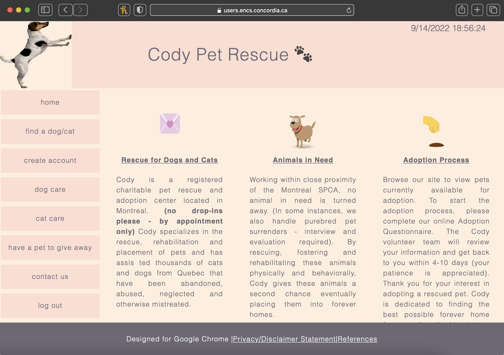

# pet_adoption
Web development project: used HTML, CSS, JS and PHP

Access website here: https://users.encs.concordia.ca/~k_nounk/home.php

| Feature                                                                                 | Description                                                                                                                                                                                                                                      |
|-----------------------------------------------------------------------------------------|--------------------------------------------------------------------------------------------------------------------------------------------------------------------------------------------------------------------------------------------------|
| Giveaway Form      | User writes their pet's characteristics in a form before putting them up for adoption which adds their pet to a database                                                                    |
| View Available Pets | User is able to visualize all the pets that were previously put up for adoption and select their pet of interest                                                                                                    |
| Login/Logout           | User is able to login into their account and keep track of the pets they have put up for adoption and the pets they have expressed interest in                                                                                           |
